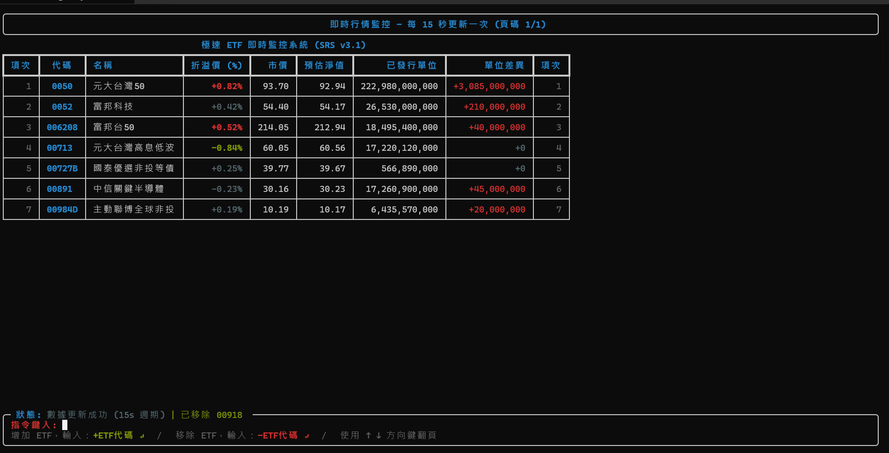

# 極速 ETF 即時監控系統

這是一個專為 Python 3.14+ 打造的專業級 ETF 溢價監控工具，旨在提供低延遲、高對位且視覺優化的即時盯盤體驗。



## 🌟 核心特色
- **整合式資料源**：透過證交所單一端點取得已整合的上市 (TWSE) 與上櫃 (TPEx) ETF 資料，每 15 秒背景自動刷新一次。
- **非阻塞監控**：更新與畫面刷新在背景 asyncio 工作執行，使用者可隨時鍵入代號、翻頁，畫面不中斷、不閃爍。
- **監控清單持久化**：清單存於 `watchlist.json`，新增/移除會即時寫回檔案，下次啟動自動沿用。
- **純即時顯示，不落地歷史**：僅在程式開啟期間顯示當下抓到的資料，不寫入資料庫。
- **Solarized Light 優化**：
  - 專為長時盯盤與高近視需求設計。
  - **溢價警示 (>0.5%)**：粗體紅色 (#DC322F)。
  - **折價警示 (<-0.5%)**：粗體綠色 (#859900)。
  - **已發行單位差異**：正值紅色、負值綠色，方便觀察申購/贖回動向。

## 🛠️ 技術對齊
- **Python 特性**：使用 `match-case` 處理 API 回應狀態碼、`f-string (=)` 進行結構化除錯輸出。
- **數據核心**：Pandas (開啟 Copy-on-Write 模式)，含千分位逗號清洗與已發行單位 x10 換算校正。
- **介面技術**：`Rich` Live 全螢幕渲染；非阻塞輸入為 Windows 專用，直接以 `msvcrt` 逐位元組讀取鍵盤（含 UTF-8 多位元組組字與方向鍵翻頁），**非** `aioconsole`（雖列於 requirements.txt，但目前程式碼未使用）。
- **資料存取**：`httpx.AsyncClient` 非同步請求，僅存於記憶體中的 DataFrame，不使用資料庫。

## 🚀 快速啟動
1. 確保已建立虛擬環境並安裝依賴：
   ```powershell
   python -m venv .venv
   .\.venv\Scripts\pip install -r requirements.txt
   ```
2. 執行啟動檔：
   - 雙擊執行 `run_monitor.bat`
   - 本程式的非阻塞輸入依賴 Windows `msvcrt`，僅能在 Windows 上跑出完整互動功能。

## ⌨️ 互動操作
在畫面底部的輸入區直接鍵入以下指令並按 Enter：

| 指令 | 說明 |
| --- | --- |
| `0056`（純代號） | 新增該代號至監控清單 |
| `+0056` | 同上，明確表示新增 |
| `-0056` | 從監控清單移除該代號 |

其他按鍵：
- **↑ / ↓ 或 PageUp / PageDown**：當清單超過單頁可顯示筆數時，翻頁瀏覽。
- **Backspace / Esc**：修正或清空目前輸入內容。

**注意**：指令欄位是以 Windows 底層按鍵讀取（`msvcrt`）實作，無法接收中文輸入法組字後的內容；輸入時請切換至英數輸入法，否則按鍵可能沒有反應（畫面上也會持續顯示這則提醒）。

**監控清單**：首次啟動若無 `watchlist.json`，預設載入 `00713`, `0050`, `0052`, `006208`, `00891`, `00727B`, `00918`, `00984D` 並建立該檔案；之後所有透過上述指令的新增/移除都會同步寫回 `watchlist.json`，並在下次啟動時載入。

## 📦 單一 .exe 版本
本專案已打包為單一執行檔 `ETF_Monitor.exe`，可於 [Releases 頁面](https://github.com/Charley-baba/ETF_Premium/releases/latest) 下載最新版本，**不需要**另外安裝 Python 或任何套件（此檔案體積較大，未收錄於原始碼版控中）。

**使用前提醒**：
- **防毒 / SmartScreen 警告**：exe 未經數位簽章，第一次執行時 Windows SmartScreen 或防毒軟體可能跳出警告，需手動選擇「仍要執行」。
- **網路權限**：程式需要連線到證交所，若當下網路環境有防火牆或代理限制對外連線，資料會抓取失敗（狀態列顯示更新失敗，但不會崩潰）。
- **同一份 exe 只認得同一個資料夾**：監控清單、log 都跟著 exe 放的資料夾走，搬到別的資料夾會視為全新環境重新產生預設清單。

